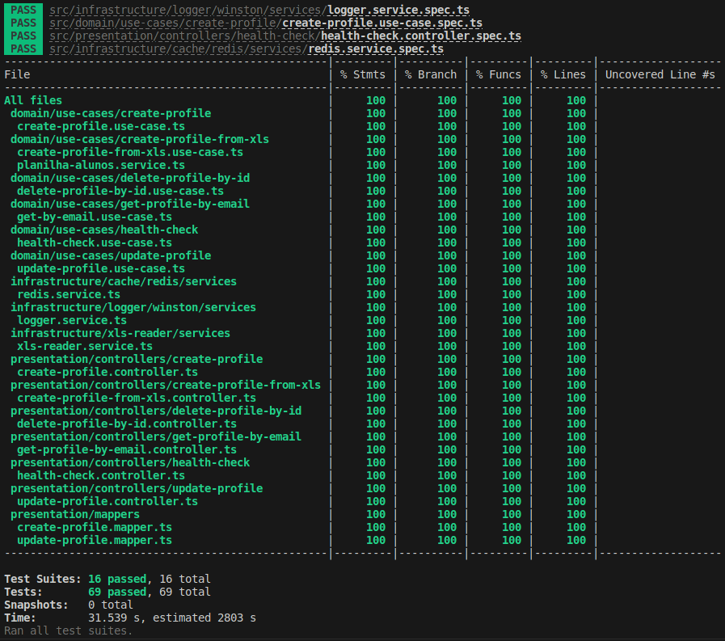

# **Teste para desenvolvedor Back-end - Proz Educação**


Essa API é um teste para seleção na empresa Proz Educação.

O desafio consiste em criar endpoints de CRUD para o gerenciamento de alunos, sendo que em um destes endpoints os dados serão inseridos através de um arquivo XLSX previamente carregado na pasta `public/xls`.

O projeto segue os princípios SOLID e foi construído sobre o modelo Clean Architecture, utilizando TDD (programação orientada a testes) como metodologia de trabalho e 100% de cobertura de testes unitários com Jest.



<br /><br />

> ## Princípios

* Single Responsibility Principle (SRP)
* Open Closed Principle (OCP)
* Liskov Substitution Principle (LSP)
* Interface Segregation Principle (ISP)
* Dependency Inversion Principle (DIP)
* Don't Repeat Yourself (DRY)
* Keep It Simple, Silly (KISS)

> ## Design Patterns

* Factory
* Adapter
* Decorator
* Dependency Injection
* Builder

> ## Metodologias e Designs

* TDD
* Clean Architecture
* DDD
* Conventional Commits
* GitFlow
* Use Cases

> ## Bibliotecas e Ferramentas

* NPM
* Typescript
* Git
* Docker
* Jest
* TypeORM
* Tsyringe
* Winston
* PG (Postgres)
* Node-xlsx
* Express
* Husky
* Lint Staged
* Eslint
* Standard Javascript Style
* Nodemon
* Rimraf
* Module-Alias

> ## Features do Node

* API Rest com Express
* Log de Erro
* CORS
* Middlewares

> ## Features do Typescript

* POO Avançado
* Interface
* TypeAlias
* Configurações

> ## Features de Testes

* Testes Unitários
* Cobertura de Testes
* Mocks
* Stubs
* Spies
* Fakes

## **Configurações iniciais**

Node 12.x

1. Instalação dos pacotes
```
yarn
```

2. Faça uma cópia do arquivo `.env.example` na pasta raiz e o renomeie para `.env`
```
cp .env.example .env
```

3. Execute o docker para iniciar os serviços necessários como banco de dados (Postgres) e cache (Redis)
```
docker-compose up -d
```

4. Após os serviços terem sido inicializados com o Docker, crie um banco de dados chamado `db_test` utilizando o seu db client favorito.

5. Execute a migration do TypeORM para criar as tabelas necessárias na sua instância Docker do banco de dados
```
yarn migration:run
```

5. Execute a aplicação com:
```
yarn start:dev
```

6. Para executar testes unitários:
```
yarn test:ci
```
## **Endpoints**

A collection de requisições para ser importada pelo Postman pode ser encontrada no path `public/postman/Testes.postman_collection.json` </br></br>

1. **Criar Profile** </br>
POST - `http://localhost:8080/api/profile` </br>
Payload: 
```
{
    "name": "Daniel",
    "email": "daniel.fb88@gmail.com",
    "civilStatus": "SOLTEIRO",
    "cpf": "sdadsad",
    "rg": "432432432",
    "birthDate": "08/02/1988",
    "gender": "MASCULINO"
}
```
</br></br>

2. **Criar Profile carregando os dados do arquivo** `./public/xls/planilha_alunos.xlsx` </br>
POST - `http://localhost:8080/api/profileFromXls` </br>
Payload: 
```
{ }
```
</br></br>

3. **Update Profile** </br>
PUT - `http://localhost:8080/api/profile?id=d6286c29-1441-4735-9f88-cb6aad102c4b` </br>
Payload: 
```
{
    "name": "Daniel UPDATED 22222",
    "civilStatus": "SOLTEIRO",
    "cpf": "sdadsad",
    "rg": "432432432",
    "birthDate": "08/02/1988",
    "gender": "MASCULINO"
}
```
</br></br>

4. **Get Profile** </br>
GET - `http://localhost:8080/api/profile?email=daniel.fb88@gmail.com` </br>
</br></br>

4. **Delete Profile** </br>
DELETE - `http://localhost:8080/api/profile?id=c0070526-b2e9-425c-b19e-f3ea495fcc02` </br>
</br></br>
